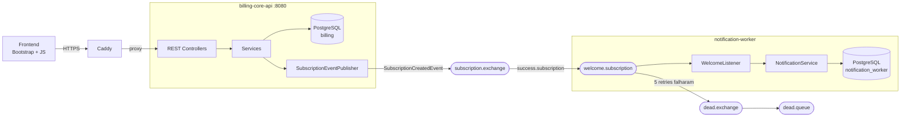

# Billing Core API

API de billing de assinaturas em Java + Spring Boot. Cuida do domínio de negócio
— usuários, planos, assinaturas e carteira pré‑paga — e publica eventos de forma
assíncrona para o [`notification-worker`](https://github.com/caioeduardopereirafelix/notification-worker-with-billing-core-api),
que trata os efeitos colaterais (e‑mail de boas‑vindas).

## Arquitetura



O `billing-core-api` nunca chama o worker diretamente: publica um
`SubscriptionCreatedEvent` no exchange `subscription.exchange` com um
`correlationId` para rastreio, e segue seu fluxo. Se o worker cair, as
assinaturas continuam sendo criadas.

## Stack

`Java 21` · `Spring Boot 3.4` (Web, Security, Data JPA, AMQP, Actuator, Cache) ·
`PostgreSQL` · `Flyway` · `JWT (jjwt)` · `MapStruct` · `Docker` · `Caddy`


## Autenticação e autorização

- `POST /auth/register` → cria o usuário com `ROLE_USER`.
- `POST /auth/login` → `{ token, expiresIn }`. O JWT (HS512) carrega `sub` e
  `roles`, usado pelo `JwtAuthenticationFilter` em cada request.
- Papéis `ROLE_USER` / `ROLE_ADMIN` são semeados pelo Flyway. Um admin é criado
  no boot quando `ADMIN_EMAIL` / `ADMIN_PASSWORD` estão setados e ainda não
  existe conta com aquele e‑mail.
- Recursos de um usuário (perfil, assinaturas) só são acessíveis pelo dono ou
  por um admin (`SecurityUtils.requireOwnerOrAdmin`).

## Endpoints

| Método | Rota | Acesso | Descrição |
|---|---|---|---|
| POST | `/auth/register` | público | cria conta |
| POST | `/auth/login` | público | autentica, devolve JWT |
| GET | `/user/me` | autenticado | perfil + saldo |
| POST | `/user/me/deposit` | autenticado | adiciona saldo (`{ amount }`) |
| GET/PUT/DELETE | `/user/{id}` | dono ou admin | perfil |
| GET | `/plan` · `/plan/{id}` | USER/ADMIN | lista / detalha planos |
| POST | `/plan` | ADMIN | cria plano |
| PUT | `/plan/{id}` | ADMIN | atualiza plano |
| PATCH | `/plan/{id}/cancel` | ADMIN | desativa plano |
| POST | `/subscription` | USER | assina um plano (`{ planId }`), debita o saldo |
| GET | `/subscription/me` | USER/ADMIN | assinaturas do próprio usuário |
| GET | `/subscription/{id}` | dono ou admin | detalha assinatura |
| GET | `/subscription` | ADMIN | todas as assinaturas |
| PATCH | `/subscription/{id}/cancel` | dono ou admin | cancela |
| GET | `/actuator/health` | público | health / liveness / readiness |

## Fluxo de assinatura

1. `POST /subscription { planId }` com JWT de `ROLE_USER`.
2. O plano precisa existir e estar **ativo**, senão `409`.
3. O **saldo pré‑pago** do usuário precisa cobrir o preço do plano, senão `402`.
   O preço é debitado do saldo e **congelado** na assinatura (mudar o preço do
   plano depois não afeta assinaturas existentes).
4. `endDate` é calculado a partir do ciclo de cobrança (`MONTHLY` / `QUARTERLY` /
   `YEARLY`).
5. Um `SubscriptionCreatedEvent` é publicado no RabbitMQ.
6. No cancelamento, `canceledAt` registra o momento; `endDate` (fim do período
   contratado) é preservado.

## Tratamento de erros

`GlobalExceptionHandler` mapeia toda exceção para um status HTTP e um corpo
`{ status, error, fieldsError }`:

| Status | Quando |
|---|---|
| 400 | validação de payload, JSON malformado, tipo de parâmetro inválido |
| 401 | credenciais inválidas / sem autenticação |
| 402 | saldo insuficiente para assinar |
| 403 | autenticado mas sem permissão no recurso |
| 404 | plano / assinatura / usuário inexistente |
| 409 | e‑mail já cadastrado, plano duplicado, regra de negócio (ex.: cancelar assinatura já cancelada) |
| 503 | broker de mensageria indisponível |

## Frontend

`frontend/` — SPA em Bootstrap 5 + JavaScript puro, servida pelo Caddy no mesmo
domínio da API (sem CORS). Login/registro, lista de planos, assinatura,
carteira (saldo + depósito) e "minhas assinaturas" com cancelamento. A seção de
criação de plano só aparece para admin (checando a claim `roles` do JWT).

## Testes

```bash
./mvnw test        # JDK 21
```

Cobre services (Mockito), controllers (`@WebMvcTest`), validação de DTOs,
mapeamento de exceções e fluxos ponta a ponta (`@SpringBootTest` + `MockMvc`):
registro → login → depósito → assinatura → cancelamento.
