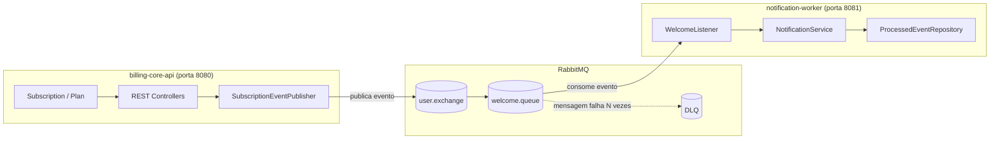

# Billing Platform

Plataforma de assinaturas (subscription billing) construída como dois microsserviços independentes em Java + Spring Boot, comunicando-se de forma assíncrona e resiliente via RabbitMQ.

## Destaques técnicos

- **Arquitetura orientada a eventos** entre dois serviços desacoplados, sem chamadas diretas entre eles
- **Mensageria resiliente**: acknowledgement manual, Dead Letter Queue e retry — nenhuma mensagem se perde silenciosamente
- **Idempotência real**: garante que o mesmo evento nunca é processado duas vezes, mesmo com reentrega
- **Modelagem orientada ao domínio de negócio**: planos configuráveis, valores de assinatura congelados no momento da contratação
- **Rastreabilidade ponta a ponta** via `correlationId`, do momento da publicação até o consumo

## Arquitetura



`billing-core-api` cuida do domínio de negócio — planos, assinaturas e endpoints REST. `notification-worker` consome eventos publicados no RabbitMQ e cuida dos efeitos colaterais assíncronos, como o e-mail de boas-vindas. Os dois são projetos Maven independentes, com ciclo de vida e escalabilidade próprios — se o envio de e-mail vira gargalo, o `notification-worker` escala sozinho, sem tocar no serviço principal.

### Fluxo ponta a ponta

1. Cliente faz `POST /subscriptions` no `billing-core-api`.
2. `SubscriptionService` associa o plano escolhido e persiste a assinatura.
3. `SubscriptionEventPublisher` publica um `SubscriptionCreatedEvent` no exchange `user.exchange`, com um `correlationId` único para rastreio.
4. RabbitMQ roteia a mensagem para a `welcome.queue`.
5. `notification-worker` consome via `WelcomeListener` e envia o e-mail de boas-vindas.
6. Falhas repetidas movem a mensagem para a **Dead Letter Queue**, garantindo que nada se perde e nada trava a fila.

## Stack técnica

`Java` · `Spring Boot` · `Spring Data JPA` · `Spring AMQP (RabbitMQ)` · `PostgreSQL` · `Docker` · `Testcontainers`

## Endpoints

### `billing-core-api`

| Método | Rota | Descrição |
|---|---|---|
| POST | `/subscriptions` | Cria uma nova assinatura |
| GET | `/subscriptions/{id}` | Busca assinatura por ID |
| GET | `/subscriptions` | Lista todas as assinaturas |
| PATCH | `/subscriptions/{id}/cancelar` | Cancela uma assinatura |
| POST | `/plans` | Cria um novo plano |
| GET | `/plans/{id}` | Busca plano por ID |
| GET | `/plans` | Lista planos ativos |
| PATCH | `/plans/{id}/desativar` | Desativa um plano |

### `notification-worker`

Sem API REST voltada ao usuário — consome eventos da fila `welcome.queue` de forma assíncrona.

## Decisões de design

**`Plan` como entidade, não enum** — planos são configuráveis via banco (nome, preço, ciclo de cobrança), pensando em evolução para além de um projeto de estudo. O valor de cada assinatura fica congelado no momento da contratação, então alterar o preço de um plano não afeta assinaturas já existentes.

**Dead Letter Queue** — mensagens que falham repetidamente (ex: serviço de e-mail indisponível) são movidas para uma fila separada, evitando tanto loop infinito de reentrega quanto perda silenciosa do evento.

**Idempotência via `correlationId`** — como o RabbitMQ garante entrega *at-least-once*, o consumidor verifica se o evento já foi processado antes de agir, evitando efeitos colaterais duplicados (como dois e-mails de boas-vindas para o mesmo cliente).

## Como rodar

```bash
# Sobe o RabbitMQ com management UI
docker run -d --name rabbitmq -p 5672:5672 -p 15672:15672 rabbitmq:3-management

# Em terminais separados
cd billing-core-api && mvn spring-boot:run
cd notification-worker && mvn spring-boot:run
```

Management UI do RabbitMQ disponível em `http://localhost:15672`.

## Testes

Testes unitários dos services, e teste de integração com Testcontainers cobrindo o fluxo completo de publicação e consumo de eventos via RabbitMQ real.

```bash
mvn test
```

## Estrutura do repositório

```
.
├── billing-core-api/
│   └── src/main/java/.../{domain,repository,service,controller,messaging,dto,exception}
└── notification-worker/
    └── src/main/java/.../{messaging,domain,repository,service,exception}
```
