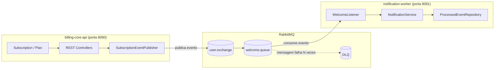

# Billing Platform

Plataforma de assinaturas (subscription billing) composta por dois microsserviços independentes, com foco em mensageria assíncrona resiliente usando RabbitMQ. Projeto de estudo prático aplicado a um cenário realista de billing, não um "hello world" de fila isolado.

## Sumário

- [Visão geral](#visão-geral)
- [Arquitetura](#arquitetura)
- [Stack técnica](#stack-técnica)
- [Endpoints](#endpoints)
- [Decisões técnicas](#decisões-técnicas)
- [Como rodar](#como-rodar)
- [Testes](#testes)
- [O que não foi implementado (e por quê)](#o-que-não-foi-implementado-e-por-quê)
- [Estrutura do repositório](#estrutura-do-repositório)

## Visão geral

O sistema permite criar planos de assinatura, associar clientes a esses planos, e dispara automaticamente um e-mail de boas-vindas de forma assíncrona quando uma assinatura é criada — sem acoplar o serviço principal ao envio de e-mail.

## Arquitetura

Dois serviços Spring Boot **totalmente independentes** — cada um com seu próprio projeto Maven, ciclo de vida e porta. A única conexão entre eles é o **RabbitMQ**.



### Por que dois serviços separados, e não um monólito?

- **Desacoplamento real:** o `billing-core-api` não sabe se existe alguém ouvindo os eventos que publica. O `notification-worker` pode ficar offline sem derrubar a criação de assinaturas — as mensagens ficam acumuladas na fila até alguém consumir.
- **Escalabilidade independente:** se o envio de e-mail vira gargalo, dá pra subir mais instâncias do `notification-worker` sem tocar no `billing-core-api`.
- **Simula um cenário real de produção**, onde serviços diferentes se comunicam por eventos, não por chamadas diretas.

### Fluxo ponta a ponta

1. Cliente faz `POST /subscriptions` no `billing-core-api`.
2. `SubscriptionService` busca o `Plan` pelo `planId` e salva a assinatura.
3. `SubscriptionEventPublisher` publica um `SubscriptionCreatedEvent` no exchange `user.exchange`, com um `correlationId` único.
4. RabbitMQ roteia a mensagem para a `welcome.queue` (routing key `user.created`).
5. `notification-worker` consome via `WelcomeListener`.
6. `NotificationService` envia o e-mail de boas-vindas.
7. Se o processamento falhar repetidamente, a mensagem é movida para a **Dead Letter Queue (DLQ)** em vez de ficar em loop ou se perder.

## Stack técnica

- Java + Spring Boot
- Spring Web, Spring Data JPA, Spring AMQP (RabbitMQ)
- PostgreSQL (produção/dev) ou H2 (testes)
- Docker (RabbitMQ via imagem `rabbitmq:3-management`)
- Testcontainers (testes de integração)

## Endpoints

### `billing-core-api`

| Método | Rota | Descrição |
|---|---|---|
| POST | `/subscriptions` | Cria uma nova assinatura |
| GET | `/subscriptions/{id}` | Busca assinatura por ID |
| GET | `/subscriptions` | Lista todas as assinaturas |
| PATCH | `/subscriptions/{id}/cancelar` | Cancela uma assinatura |
| POST | `/plans` | Cria um novo plano |
| GET | `/plans/{id}` | Busca plano por ID |
| GET | `/plans` | Lista planos ativos |
| PATCH | `/plans/{id}/desativar` | Desativa um plano |

### `notification-worker`

Não expõe API REST voltada ao usuário final — apenas consome eventos da fila `welcome.queue`. Health check via Actuator, se configurado.

## Decisões técnicas

### `Plan` como entidade, não enum

Planos são configuráveis via banco (nome, preço, ciclo de cobrança, ativo/inativo) em vez de um enum fixo no código — pensando na evolução do projeto para além do estudo. `Subscription.amount` fica congelado no momento da criação, então mudar o preço de um `Plan` não afeta assinaturas já existentes.

### Dead Letter Queue (DLQ)

Sem DLQ, uma mensagem que falha no consumidor (ex: serviço de e-mail fora do ar) tem dois destinos ruins: reentrega infinita ou perda silenciosa. A DLQ move a mensagem para uma fila separada após N tentativas, permitindo inspeção e reprocessamento manual sem bloquear o fluxo normal. Numa plataforma de billing, perder o evento de "novo assinante" significa cliente pagando sem confirmação — inaceitável.

### Idempotência do consumidor

RabbitMQ garante entrega *at-least-once*: a mesma mensagem pode chegar mais de uma vez. Sem controle de idempotência, isso significa risco de enviar dois e-mails de boas-vindas para o mesmo cliente. `ProcessedEventRepository` guarda os `correlationId` já processados, garantindo que cada evento seja tratado uma única vez.

## Como rodar

Pré-requisitos: Java, Maven, Docker.

```bash
# Sobe o RabbitMQ com management UI
docker run -d --name rabbitmq -p 5672:5672 -p 15672:15672 rabbitmq:3-management

# Em terminais separados
cd billing-core-api && mvn spring-boot:run
cd notification-worker && mvn spring-boot:run
```

Management UI do RabbitMQ disponível em `http://localhost:15672` (`guest`/`guest`).

## Testes

- Testes unitários dos services (`SubscriptionService`, `PlanService`, `NotificationService`)
- Teste de integração com Testcontainers + RabbitMQ real, cobrindo o fluxo publish → consume
- Teste cobrindo o cenário de DLQ (mensagem malformada ou processamento que falha repetidamente)

```bash
mvn test
```

## Estrutura do repositório

```
.
├── billing-core-api/
│   ├── pom.xml
│   └── src/main/java/.../{domain,repository,service,controller,messaging,dto,exception}
└── notification-worker/
    ├── pom.xml
    └── src/main/java/.../{messaging,domain,repository,service,exception}
```
